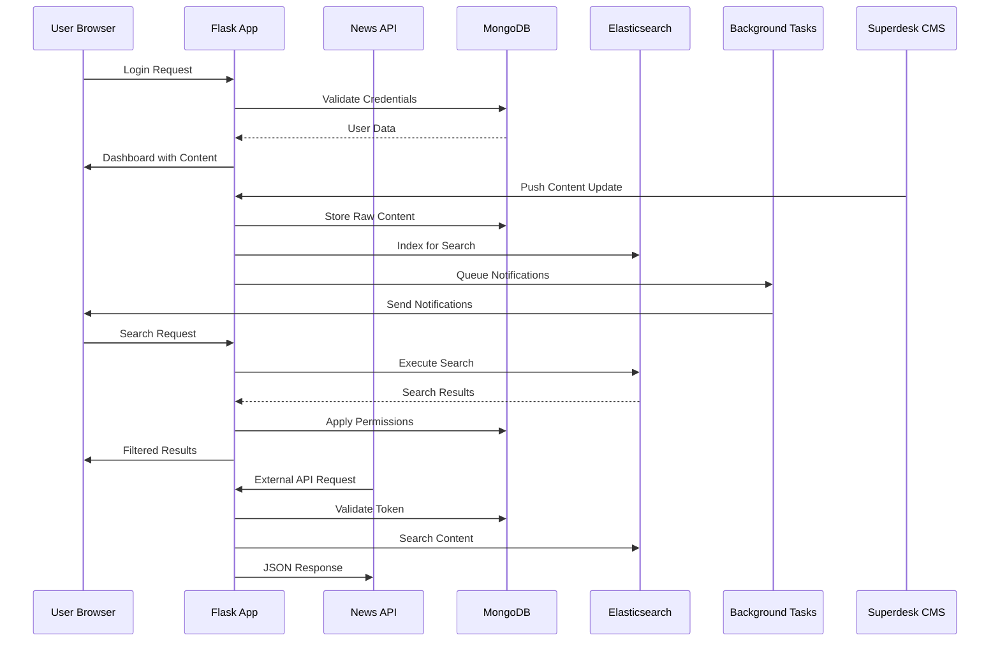

# Newsroom System Architecture -  Analysis and Improvement

## System Overview

The Newsroom application is a comprehensive news management and distribution platform built on Flask/Python backend with React/Redux frontend, designed for media organizations to manage, distribute, and monetize news content.

## Architecture Diagram

```mermaid
graph TB
    subgraph "Frontend Layer"
        UI[React/Redux UI]
        WEBPACK[Webpack Build System]
        ASSETS[Static Assets]
    end

    subgraph "Web Application Layer"
        FLASK[Flask Web App - NewsroomWebApp]
        BLUEPRINTS[Flask Blueprints]
        TEMPLATES[Jinja2 Templates]
        FILTERS[Template Filters]
    end

    subgraph "Core Modules"
        AUTH[Authentication & Sessions]
        COMPANIES[Company Management]
        USERS[User Management]
        WIRE[Wire Service]
        AGENDA[Agenda/Events]
        PRODUCTS[Products & Subscriptions]
        NOTIFICATIONS[Notifications]
        TOPICS[Topics & Saved Searches]
        CARDS[Dashboard Cards]
        REPORTS[Analytics & Reports]
    end

    subgraph "API Layer"
        NEWSAPI[News API]
        SEARCH[Search APIs]
        RESTAPI[REST Endpoints]
    end

    subgraph "Data Layer"
        MONGO[(MongoDB)]
        ELASTIC[(Elasticsearch)]
        REDIS[(Redis Cache)]
    end

    subgraph "External Services"
        SUPERDESK[Superdesk CMS]
        EMAIL[Email Service]
        S3[Amazon S3]
        PUSH[Push Notifications]
    end

    subgraph "Background Processing"
        CELERY[Celery Workers]
        BEAT[Celery Beat Scheduler]
        WEBSOCKET[WebSocket Server]
    end

    subgraph "Deployment"
        DOCKER[Docker Compose]
        VAGRANT[Vagrant VM]
        GUNICORN[Gunicorn WSGI]
        NGINX[Nginx Proxy]
    end

    UI --> FLASK
    WEBPACK --> ASSETS
    FLASK --> BLUEPRINTS
    BLUEPRINTS --> AUTH
    BLUEPRINTS --> COMPANIES
    BLUEPRINTS --> USERS
    BLUEPRINTS --> WIRE
    BLUEPRINTS --> AGENDA
    BLUEPRINTS --> PRODUCTS
    BLUEPRINTS --> NOTIFICATIONS
    BLUEPRINTS --> TOPICS
    BLUEPRINTS --> CARDS
    BLUEPRINTS --> REPORTS
    
    FLASK --> NEWSAPI
    FLASK --> SEARCH
    FLASK --> RESTAPI
    
    AUTH --> MONGO
    COMPANIES --> MONGO
    USERS --> MONGO
    WIRE --> ELASTIC
    AGENDA --> ELASTIC
    PRODUCTS --> MONGO
    NOTIFICATIONS --> REDIS
    
    SUPERDESK --> WIRE
    SUPERDESK --> AGENDA
    EMAIL --> NOTIFICATIONS
    S3 --> ASSETS
    
    CELERY --> MONGO
    CELERY --> ELASTIC
    BEAT --> CELERY
    WEBSOCKET --> PUSH
    
    DOCKER --> MONGO
    DOCKER --> ELASTIC
    DOCKER --> REDIS
    VAGRANT --> DOCKER
    GUNICORN --> FLASK
```

## Detailed Component Analysis

### 1. Core Application Architecture 

**Main Components:**
- **NewsroomWebApp**: Main Flask application extending Eve framework
- **NewsroomApp**: Base factory class with media storage, babel, blueprints setup
- **Configuration**: Hierarchical config from default_settings.py, environment variables, and custom settings

**Key Features:**
- Modular blueprint-based architecture
- Jinja2 templating with custom filters and globals
- Rate limiting with Flask-Limiter
- Webpack integration for frontend assets
- Theme support with customizable templates

### 2. Backend Modules Deep Dive 

**Authentication & Authorization:**
- Session-based authentication with bcrypt password hashing
- Role-based access control (Administrator, Internal, Public, Company Admin, Account Management)
- Login attempt tracking and account lockout protection
- Password reset and email validation flows

**Company Management:**
- Multi-tenant architecture with company-based permissions
- Section-based access control (wire, agenda, monitoring, etc.)
- Expiry date management and alerts
- Embedded media permissions (video, audio, images, social media)

**Content Management:**
- **Wire Service**: News articles with full-text search, bookmarking, sharing
- **Agenda**: Event management with planning items and coverage tracking
- **Products**: Subscription-based content filtering and distribution
- **Topics**: User-defined saved searches with notifications

**Media & Assets:**
- Image handling with thumbnail generation and renditions
- Video and audio embedding with permission controls
- Amazon S3 and GridFS storage backends
- Watermark and copyright protection

### 3. Frontend Architecture Analysis 

**Technology Stack:**
- React 16.6.0 with Redux for state management
- Webpack 3.x build system with hot reloading
- Bootstrap 4 for responsive UI
- Babel for ES6+ transpilation
- SASS/SCSS for styling

**Component Structure:**
- Modular component architecture in `/assets/components/`
- Feature-based organization (wire, agenda, companies, users, etc.)
- Reusable UI components (modals, forms, cards, filters)
- Redux store with normalized state management

**Key Features:**
- Real-time updates via WebSocket
- Responsive grid/list view toggle
- Advanced search and filtering
- Drag-and-drop interfaces
- Print and export functionality

### 4. Database & Data Models 

**MongoDB Collections:**
- **users**: User profiles, authentication, company associations
- **companies**: Multi-tenant organization data with permissions
- **products**: Content filtering and subscription definitions
- **topics**: User-defined searches and alerts
- **notifications**: System and user notifications
- **history**: Audit trail for user actions
- **ui_config**: Frontend configuration settings

**Elasticsearch Indices:**
- **items**: Full-text searchable news content
- **agenda**: Event and planning data with location/time indexing
- Content synchronization from MongoDB to Elasticsearch

**Redis Usage:**
- Session storage and caching
- Login attempt tracking
- Real-time notifications
- Background job queuing

### 5. API Endpoints & Routing 

**REST API Structure:**
- `/api/*`: Internal API endpoints for frontend
- `/news_api/*`: External News API for third-party access
- Blueprint-based routing with method-specific handlers

**Key Endpoints:**
- Authentication: `/login`, `/logout`, `/signup`
- Content: `/wire/*`, `/agenda/*`
- User Management: `/users/*`, `/companies/*`
- Search: `/wire/search`, `/agenda/search`
- Actions: `/wire/bookmark`, `/wire/share`, `/wire/download`

**Authentication:**
- Session-based for web interface
- Token-based for News API
- Role-based endpoint access control

### 6. Integrations & External Services 

**Superdesk CMS Integration:**
- Content ingestion via push notifications
- Planning and coverage synchronization
- Media asset management
- Workflow state tracking

**Background Processing:**
- **Celery**: Async task processing (email, notifications, exports)
- **Beat Scheduler**: Periodic tasks (expiry alerts, data cleanup)
- **WebSocket**: Real-time updates and notifications

**External Services:**
- **Email**: SMTP integration for notifications and alerts
- **Amazon S3**: Media storage and CDN
- **Push Notifications**: Real-time user notifications

### 7. Security & Permissions Analysis 

**Authentication Security:**
- Bcrypt password hashing with salt
- Session-based authentication with CSRF protection
- Login attempt rate limiting and account lockout
- Password strength requirements (minimum 8 characters)

**Authorization Model:**
- Hierarchical user roles with granular permissions
- Company-based multi-tenancy with section access control
- Resource-level permissions for content access
- API token management for external access

**Data Security:**
- Input validation with Eve/Cerberus schemas
- SQL injection protection through MongoDB ODM
- XSS protection via template escaping
- CORS configuration for API access

### 8. Testing & Quality Infrastructure 

**Test Coverage:**
- Unit tests for core modules (auth, companies, users, wire, agenda)
- Integration tests for API endpoints
- Feature tests with BDD (Gherkin scenarios)
- Mock fixtures for consistent test data

**Testing Tools:**
- Python: pytest framework with fixtures
- JavaScript: Karma + Jasmine for frontend testing
- Mock services for external dependencies
- Test database isolation

**Quality Measures:**
- ESLint for JavaScript code quality
- Python code follows PEP8 standards
- Comprehensive error handling and logging
- Performance monitoring and profiling

### 9. Deployment & Infrastructure 

**Development Environment:**
- **Docker Compose**: Multi-service local development
- **Vagrant**: VM-based development environment
- **Webpack Dev Server**: Hot reloading for frontend development

**Production Deployment:**
- **Gunicorn**: WSGI application server
- **Nginx**: Reverse proxy and static file serving (implied)
- **Procfile**: Heroku-compatible process definitions
- Multiple processes: web, newsapi, websocket, celery workers, beat scheduler

**Infrastructure Services:**
- MongoDB 3.x for primary data storage
- Elasticsearch 2.x for search indexing
- Redis 3.x for caching and sessions

## Data Flow Architecture

## Key Strengths

1. **Modular Architecture**: Clean separation of concerns with Flask blueprints
2. **Multi-Tenancy**: Robust company-based isolation and permissions
3. **Real-Time Features**: WebSocket integration for live updates
4. **Search Performance**: Elasticsearch for fast full-text search
5. **Media Handling**: Comprehensive image/video management with permissions
6. **API-First Design**: Both web UI and external API access
7. **Background Processing**: Scalable async task handling with Celery
8. **Security Model**: Role-based access control with granular permissions

## Areas for Improvement

1. **Dependency Updates**: Upgrade to newer versions of React, Webpack, Flask components
2. **Performance Optimization**: Add caching layers and query optimization
3. **Monitoring**: Add APM and health check endpoints
4. **Documentation**: Expand API documentation and deployment guides
5. **Testing**: Increase test coverage and add end-to-end tests
6. **Security**: Implement additional security headers and audit logging

## Technology Migration Path

1. **Phase 1**: Upgrade core dependencies (React 18, Webpack 5, Python 3.9+)
2. **Phase 2**: Modernize frontend with hooks and functional components
3. **Phase 3**: Add monitoring, logging, and performance optimizations
4. **Phase 4**: Consider microservices architecture for scaling

This newsroom platform represents a sophisticated, production-ready news management system with strong multi-tenancy, comprehensive content management, and robust security features.